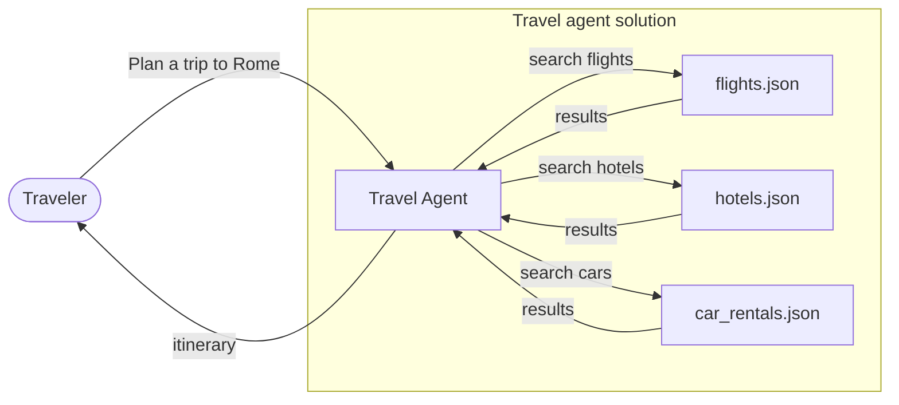

# Part 2: Build and Evaluate an Agent

## Scenario
In this hands-on workshop, you will build a travel concierge agent that helps customers plan trips. You will ground the agent with flight, hotel, and car rental data from JSON files.

You will then evaluate the agent in **Microsoft Foundry Agent Service** and improve its instructions with **Agent Optimizer**.

## Requirements

Before you begin, make sure the following resources are available:

- A Microsoft Foundry project
- A deployed GPT or Claude model
- An Application Insights resource

## Workshop Guide

Complete the guide in order:

| Step | Guide | What you will do |
| ---: | --- | --- |
| 1 | [Create the agent](guide/01_foundry_portal.md) | Create and configure the travel concierge agent in Microsoft Foundry. |
| 2 | [Set up metrics](guide/02_set_metrics.md) | Enable quality and safety evaluators in the playground. |
| 3 | [Run prompts](guide/03_run_prompt.md) | Test the agent and inspect its metrics, traces, and monitoring data. |
| 4 | [Evaluate the agent](guide/04_evaluate.md) | Run a full-conversation evaluation and review the results. |
| 5 | [Optimize the agent](guide/06_optimize_agent.md) | Generate, compare, and promote an improved agent candidate. |