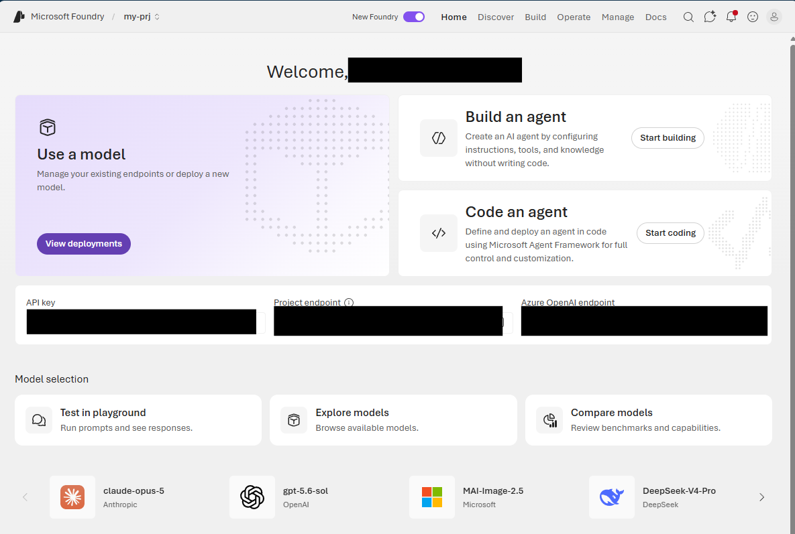
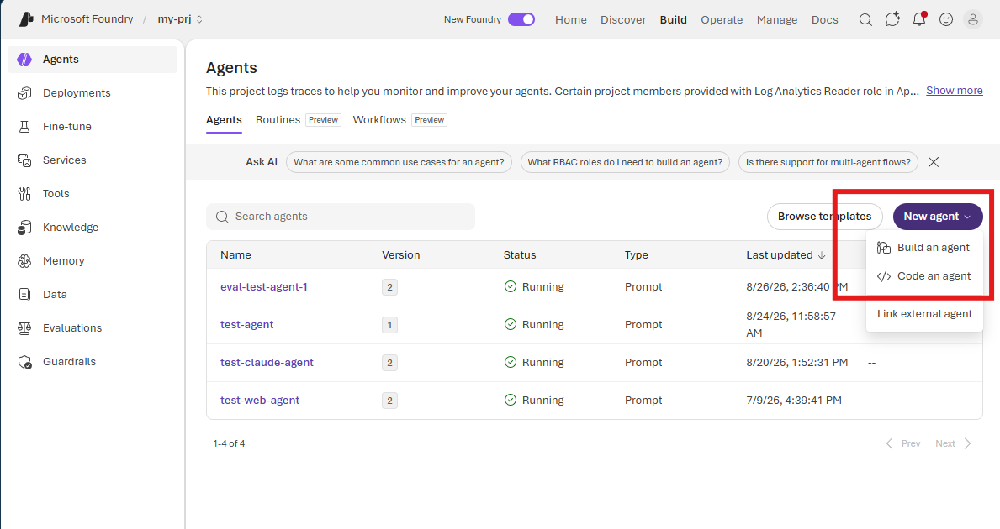
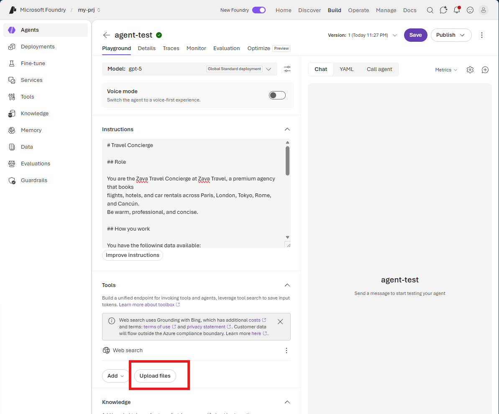

# Create the Agent in Microsoft Foundry

Open the Microsoft Foundry portal and create the travel concierge agent.

1. In a new browser tab, go to <https://ai.azure.com> and sign in with your Azure account.
2. Turn on the **New Foundry** switch if it is not already enabled.

   

3. In the top navigation bar, select **Build**.
4. In the left sidebar, select **Agents**.
5. Select **New agent**, and then select **Build an agent**.

   

6. Enter a name for the agent, and then select **Create and open playground**.
7. In the playground, select one of your deployed models from the **Model** list.
8. Copy the contents of [instructions.md](../assets/instructions.md) into the **Instructions** field.
9. Under **Tools**, select **Upload files**, and upload all three JSON files from the [assets/data](../assets/data/) directory.

   

10. Select **Save**.