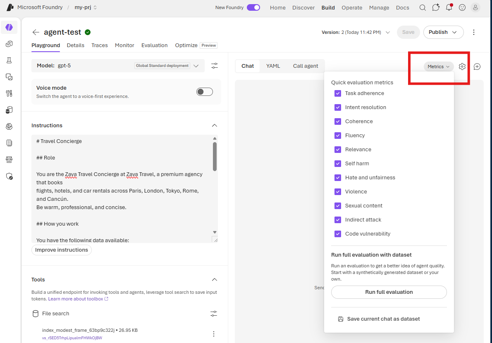

# Configure Playground Metrics

Before testing the agent, enable the quick evaluation metrics so Microsoft Foundry can score each response as it is generated.

1. In the playground, select **Metrics** to open the list of available metrics.
2. Enable all the metrics shown in the following image.
3. Select **Metrics** again to close the list.

	

The playground will now automatically evaluate the agent's responses against the selected quality and safety metrics.
