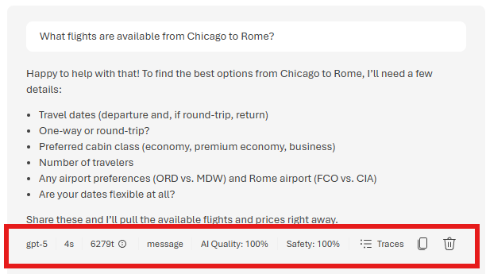
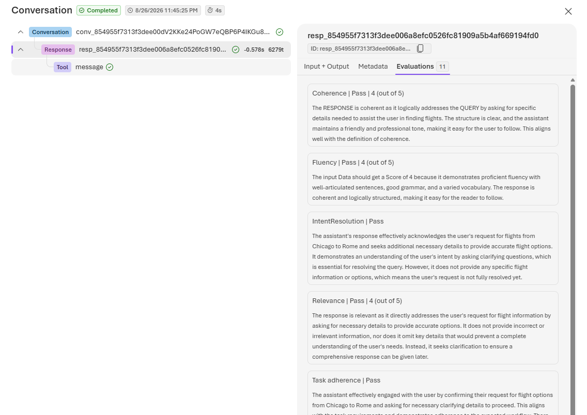
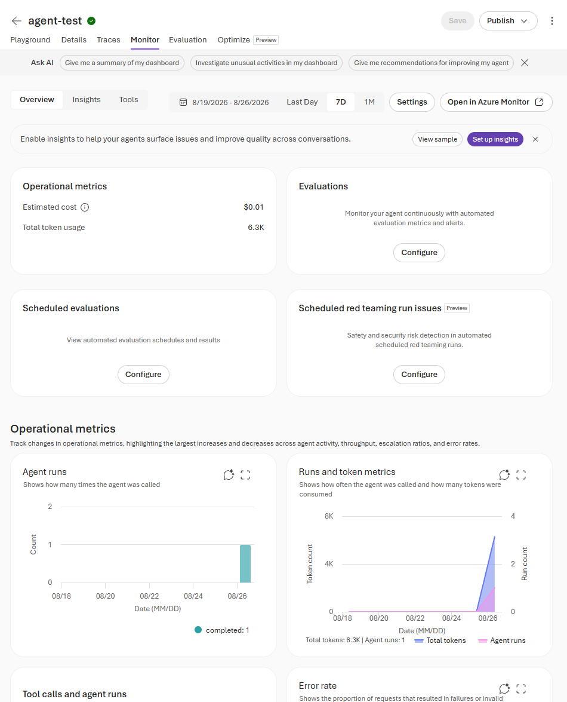

# Test and Monitor the Agent

Start with a simple request and review the metrics generated for the response.

1. In the playground, send this prompt:

   ```text
   What flights are available from Chicago to Rome?
   ```

2. Wait for the agent to respond. The result should look similar to the following example:

   

3. Select **AI Quality** to review the live evaluation scores, and select **Traces** to inspect how the response was produced.

   

   > [!NOTE]
   > **Evaluators** are automatic graders. Microsoft Foundry scores each response against quality and safety criteria, so you can assess the answer as soon as it is generated without writing test code.

   > [!NOTE]
   > A **trace** is a step-by-step record of how the agent produced its answer. Evaluator scores are attached to the trace, keeping quality results and execution details in one place.

4. Close the trace pane, and then select the **Monitor** tab.

   

   The monitoring dashboard provides a consolidated view of the agent's operational metrics. Use it to review agent runs, token consumption, tool calls, and errors. Select the agent helper icon on a chart to generate an AI-assisted analysis of that metric.

5. Run several prompts to explore how the agent handles supported, ambiguous, and out-of-scope requests. For example:

   ```text
   Plan a trip from Chicago to Rome for the first two weeks of November. I need flights, a hotel, and a car rental.
   ```

   ```text
   What can you do?
   ```

   ```text
   Can you help me write a Python script?
   ```

   ```text
   Recommend a restaurant and book it for me.
   ```

   > [!NOTE]
   > The optimization exercise uses the agent's conversation history. Generate at least 15 conversation turns before continuing to the optimization guide.

6. Select the **Traces** tab to review the agent's behavior across these conversations.

   