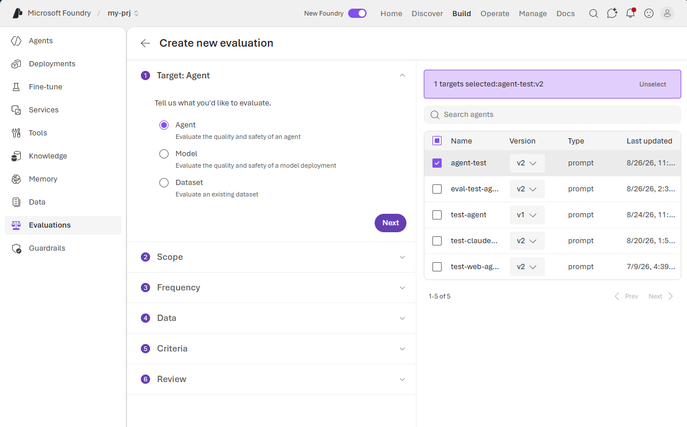
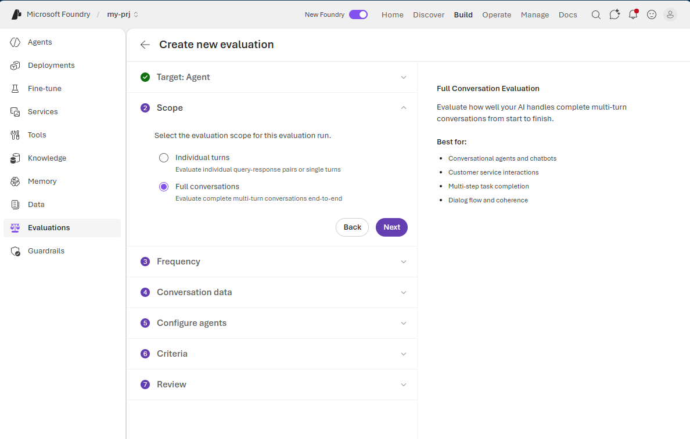
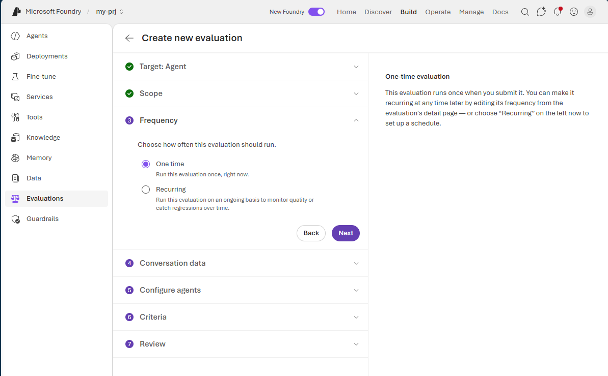
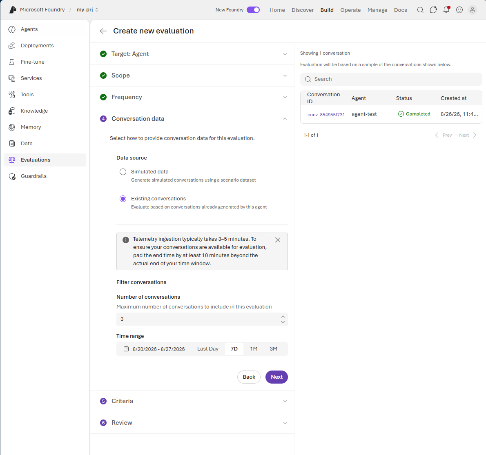
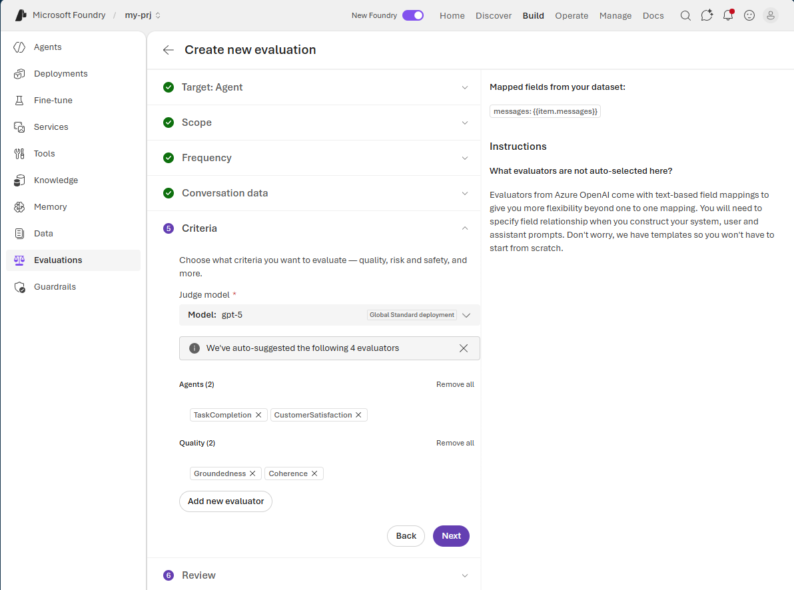
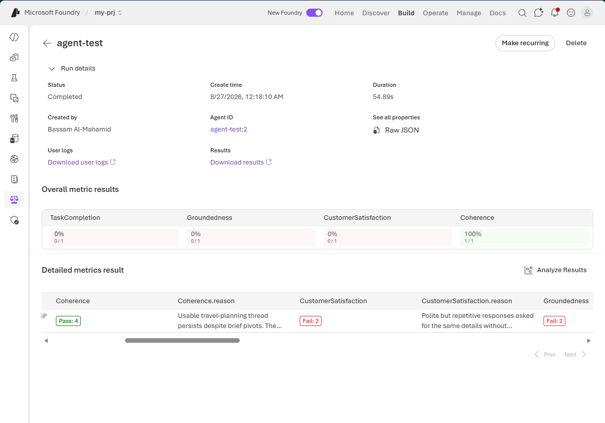
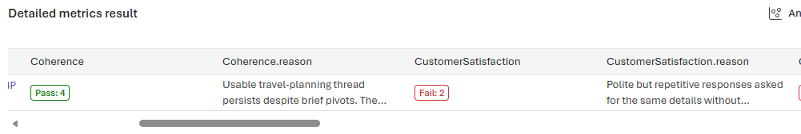

# Evaluate the Agent

Run a one-time evaluation to measure the quality of the agent's conversations.

1. On the agent page, select the **Evaluation** tab.

2. Select **Create** to start a new evaluation.

    

3. Configure the evaluation with the following settings:

    - **Target:** Evaluations can target an agent, model, or dataset. Select **Agent**, and then select the agent you created.
    - **Scope:** Choose whether to evaluate individual turns or complete conversations. Select **Full conversations**.
    - **Frequency:** Choose whether to run the evaluation once or on a recurring schedule. Select **One time**.
    - **Conversation data:** Choose simulated data or conversations already generated by the agent. Select **Existing conversations**.
    - **Criteria:** Select a judge model and the evaluation metrics. Microsoft Foundry provides built-in evaluators such as **Groundedness**, **Coherence**, **Customer Satisfaction**, and **Task Completion**.

    

    

    

    

    

4. Submit the evaluation.

5. When the evaluation is complete, review the generated report. It includes an overall result for each metric, along with detailed scores and explanations for each evaluated conversation.

    

    