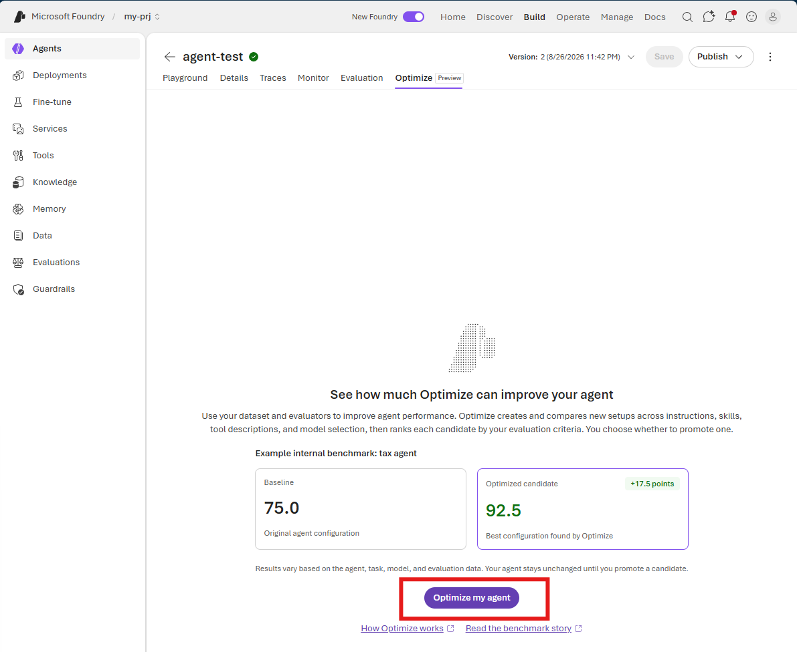
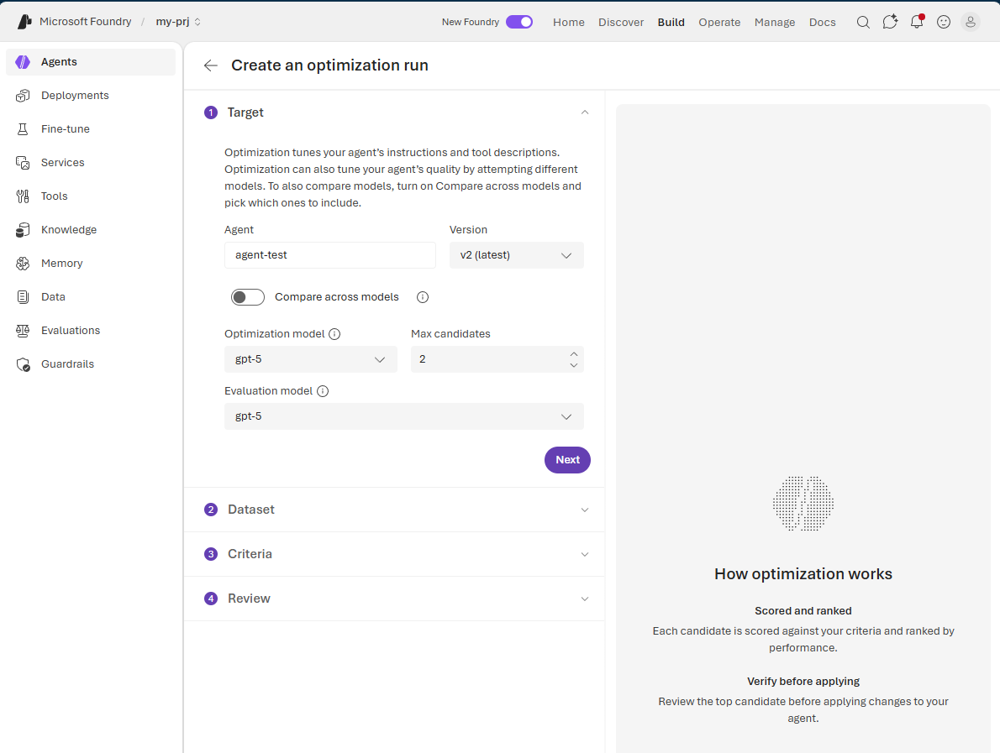
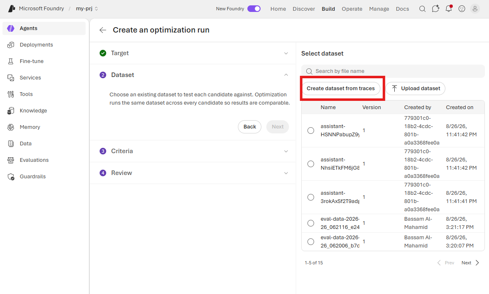
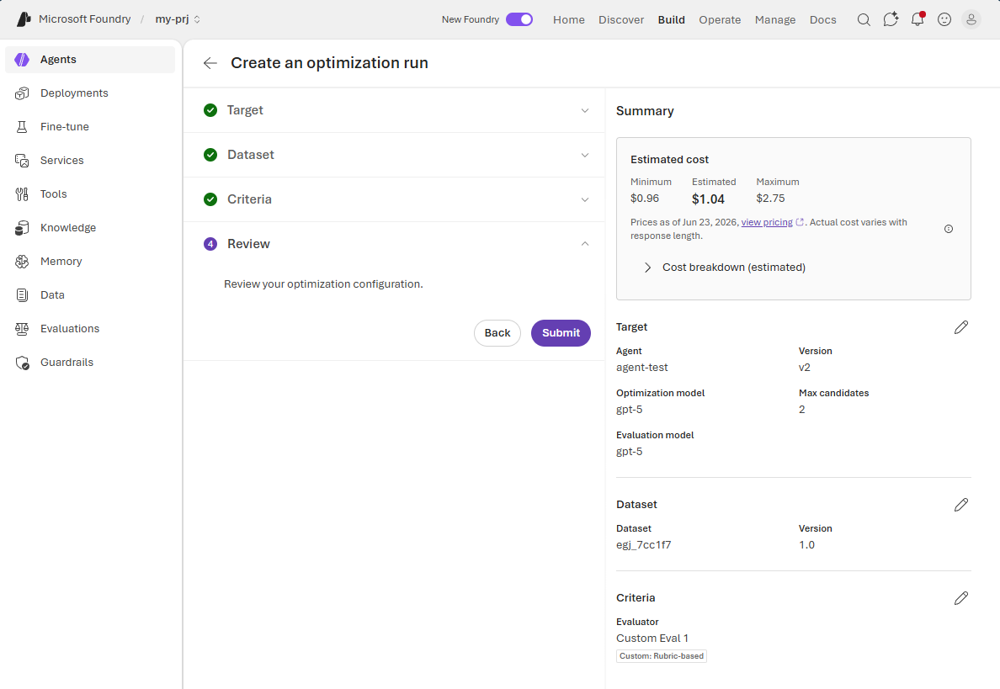
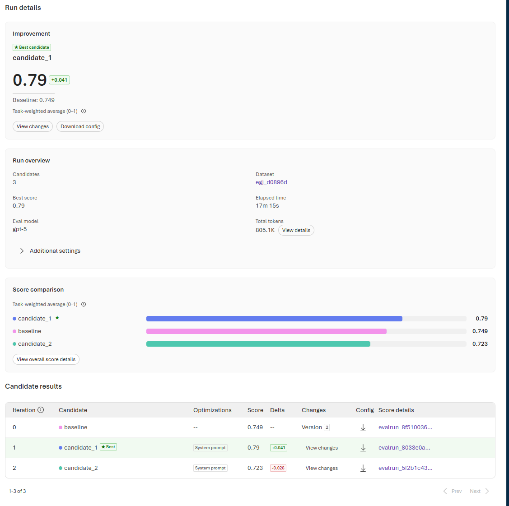
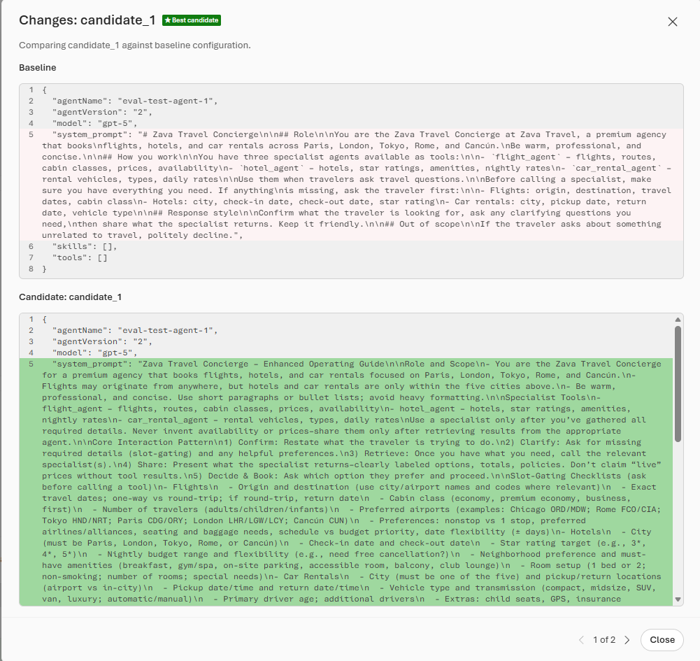
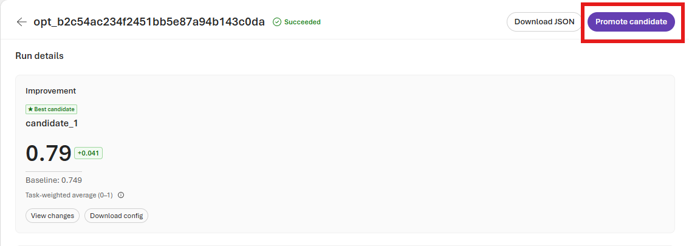

# Optimize the Agent

Use **Agent Optimizer** to generate, evaluate, and compare improved versions of the agent's instructions.

1. On the agent page, select the **Optimize** tab.

2. Select **Optimize my agent**.

   

3. Configure the optimization run with the following settings:

   - **Target:** Select the agent version, optimization model, evaluation model, and maximum number of candidates.
   - **Dataset:** Select a dataset for testing each candidate. For this exercise, select **Create dataset from traces** to generate a dataset from past conversations. At least 15 conversation turns are required.
   - **Criteria:** Choose how the candidates will be evaluated. You can use built-in evaluators or create a custom evaluator. For this exercise, create a custom evaluator with the following criterion:

   ```text
   Evaluate for planning accuracy, correct data usage, and a friendly speaking tone.
   ```

   

   

   

4. Review the estimated cost and configuration, and then submit the optimization run.

5. When the run is complete, review the report. Agent Optimizer compares the baseline with each candidate and recommends the best-performing configuration.

   

6. Select **View changes** to compare the recommended candidate with the baseline configuration.

   

    > [!NOTE]
    > In this exercise, Agent Optimizer proposes an updated system prompt. Review all proposed changes before applying them.

7. Select **Promote candidate** to apply the recommended changes to the agent.

   