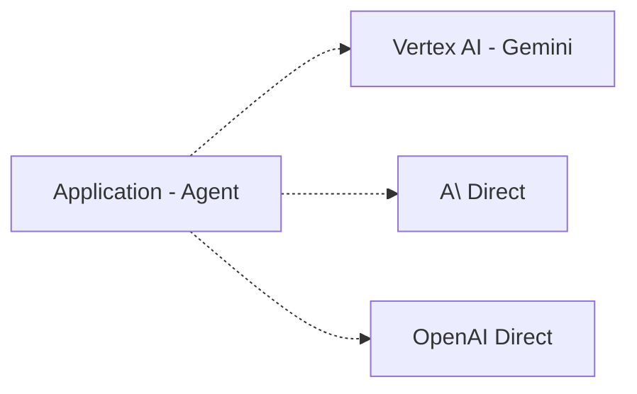
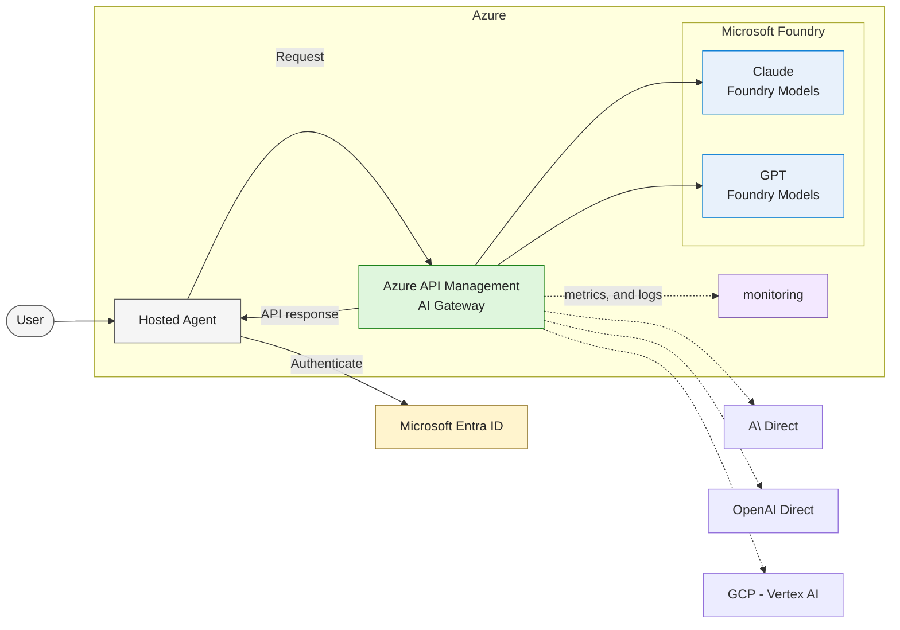

# Architecture

## Current Architecture

## Wokshop Architecture

```mermaid
flowchart LR
    user([User])
    app[Application - Agent]
    
    A[A\ Direct]
    O[OpenAI Direct]
    vertexAI[GCP - Vertex AI]

    subgraph azure[Azure]
        gateway[Azure API Management<br/>AI Gateway]
        monitoring

        subgraph foundry[Microsoft Foundry]
            claude[Claude<br/>Foundry Models]
            gpt[GPT<br/>Foundry Models]
        end
    end

    user --> app
    
    app -->|Request | gateway
    gateway --> claude
    gateway --> gpt
    gateway -.-> vertexAI
    gateway -.-> A
    gateway -.-> O
    gateway -->|API response| app

    gateway -.->|metrics, and logs| monitoring
    
    classDef identity fill:#fff4ce,stroke:#8a6d1d,color:#242424;
    classDef gateway fill:#dff6dd,stroke:#107c10,color:#242424;
    classDef foundryService fill:#e8f1fb,stroke:#0078d4,color:#242424;
    classDef operations fill:#f3e8ff,stroke:#744da9,color:#242424;
    classDef client fill:#f5f5f5,stroke:#5c5c5c,color:#242424;

    class user,app client;
    class entra identity;
    class gateway gateway;
    class agent,claude,gpt foundryService;
    class monitoring,evaluation operations;
```

## To Be Architecture

| Capability | APIM policy / service | Why it matters in production |
| --- | --- | --- |
| Authentication | `validate-jwt` + managed identity to backends | No API keys in client apps or stored in gateway config |
| Rate and cost control | `azure-openai-token-limit` | Prevents one tenant from consuming the whole TPM quota |
| Cost attribution | `azure-openai-emit-token-metric` | Per-team and per-app chargeback in Application Insights |
| Latency and cost reduction | `azure-openai-semantic-cache-lookup` / `-store` | Serves repeated prompts from Redis without a model call |
| Resilience | Backend pool with circuit breaker | Regional failover, PTU-first with pay-as-you-go spillover |
| Responsible AI | `llm-content-safety` | Jailbreak and prompt-injection detection before inference |
| Network isolation | Private endpoints + VNet integration | Backends unreachable from the public internet |